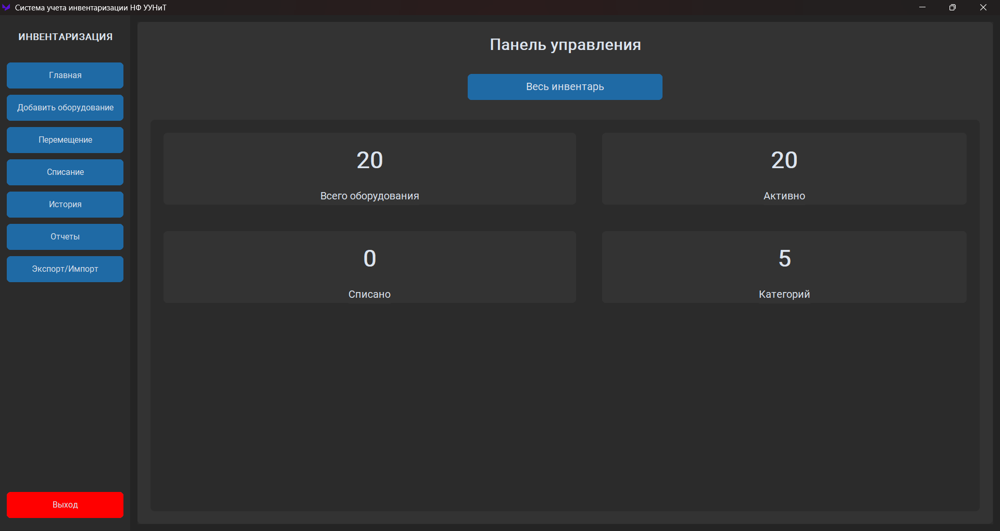
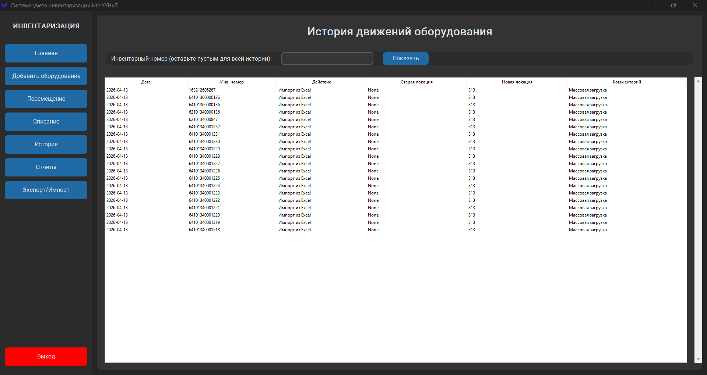

# 📦 Система учета инвентаризации (Inventory Management System)

Полнофункциональное десктопное приложение для автоматизации учета компьютерного парка (разработано для НФ УУНиТ). Приложение позволяет отслеживать жизненный цикл оборудования: от прихода и перемещения до списания, с полным аудитом всех операций.

## 🛠 Стек технологий
- **Язык:** Python 3.13
- **GUI:** CustomTkinter (современный дизайн, темная тема, адаптивность)
- **База данных:** SQLite (реляционная модель с внешними ключами)
- **Работа с данными:** `openpyxl` (импорт/экспорт в Excel)
- **Сборка:** PyInstaller (создание автономного `.exe` файла)

## ✨ Ключевой функционал
- **Модульная архитектура:** Разделение логики БД (`db_manager.py`) и интерфейса (отдельные классы-фреймы для каждого экрана).
- **Полный цикл учета:** Добавление, перемещение между кабинетами и списание оборудования с указанием причин.
- **Аудит и история:** Каждая операция фиксируется в таблице `history`, что позволяет восстановить полную цепочку событий по любому активу.
- **Массовые операции:** Импорт данных из Excel-шаблонов и экспорт отчетов с гибкой фильтрацией (по локации, дате, категории).
- **Защита от ошибок:** Строгая валидация пользовательского ввода и обработка исключений при работе с БД и файлами.

## 🚀 Как запустить проект

1. Клонируйте репозиторий:
   ```bash
   git clone https://github.com/acidkil1/inventory-management-system.git
   cd inventory-management-system
   ```

2. Создайте и активируйте виртуальное окружение:
   ```bash
   python -m venv venv
   source venv/bin/activate  # Для Windows: venv\Scripts\activate
   ```
   
3. Установите зависимости:
   ```bash
   pip install -r requirements.txt
   ```
   
4. Запустите приложение:
   ```bash
   python inventory.py
   ```

## 🧠 Чему я научился и какие навыки развил (Key Takeaways)
Этот проект стал для меня переходом от написания простых скриптов к созданию надежных, готовых к использованию приложений. 
- **Проектирование архитектуры БД:** Я научился проектировать реляционные схемы с использованием внешних ключей (`FOREIGN KEY`), что обеспечило целостность данных и защитило базу от появления "сиротских" записей или дубликатов инвентарных номеров.
- **Надежность и отладка (Debugging):** Я внедрил строгую валидацию входных данных и блоки `try-except` при чтении Excel-файлов и запросах к БД. Это научило меня предвидеть некорректное поведение пользователя и делать приложение устойчивым к сбоям (например, попытка переместить уже списанное оборудование блокируется на уровне логики).
- **ООП в GUI:** Разделение интерфейса на независимые классы-фреймы (`DashboardFrame`, `AddEquipmentFrame` и т.д.) научило меня управлять состоянием приложения и избегать "спагетти-кода" в графических интерфейсах.

## 📸 Скриншоты


